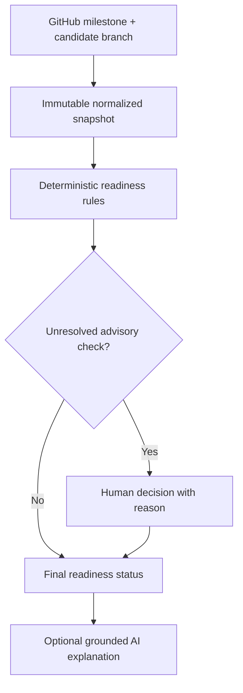
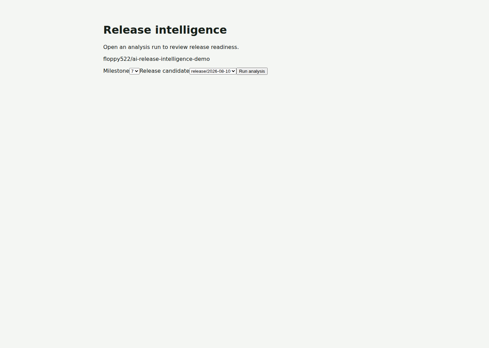
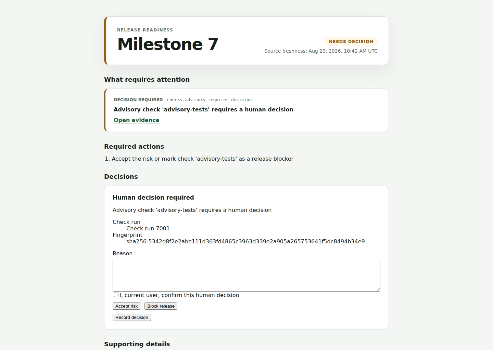
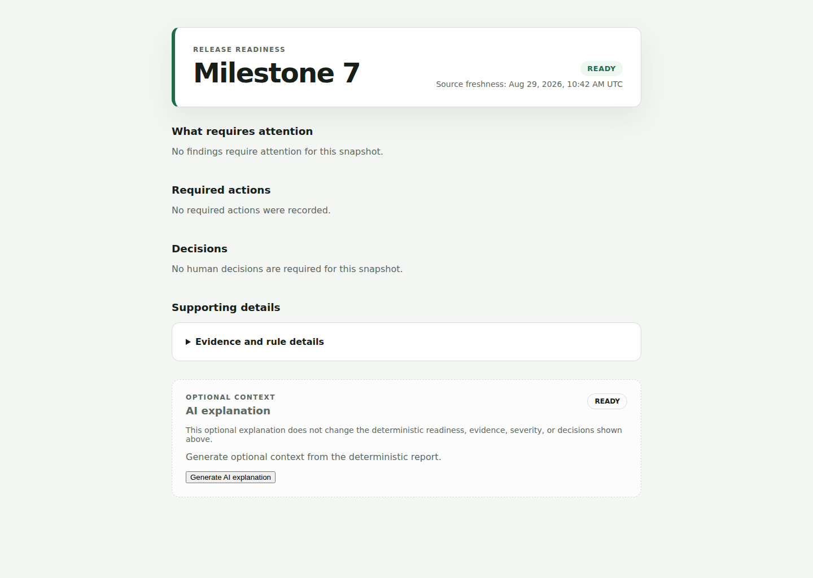
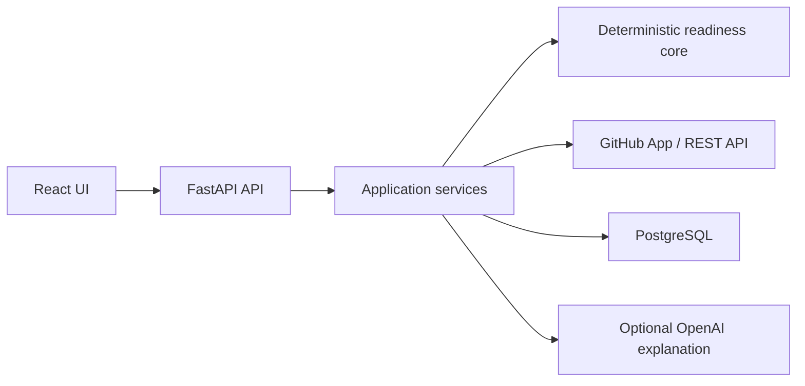

# AI Release Intelligence

**Evidence-backed Go/No-Go decision support for GitHub-native releases.**

AI Release Intelligence turns one GitHub Milestone and one release-candidate
branch into a deterministic readiness assessment. It reconciles release scope,
pull requests, CI checks, blockers, operational actions, migrations, and
back-merges, then presents a prioritized report with direct links to evidence.

The LLM is deliberately outside the decision path:

```text
GitHub data → normalized snapshot → deterministic findings
            → human decisions → readiness status → optional AI explanation
```

The product is designed for Release Managers and Technical Project Managers in
small teams that run planned releases from GitHub.

## Why this project exists

A weekly release review often means opening multiple GitHub pages and manually
answering the same questions:

- Does every code-bearing issue have a linked pull request?
- Is the change merged to `main` and present in the release candidate?
- Which failed checks are blocking, advisory, or irrelevant?
- Are critical blockers closed?
- Are before/during/after release actions documented?
- Is migration evidence machine-verifiable?
- Were changes from the previous release branch back-merged to `main`?

The experience-based baseline behind this project is 30–60 minutes for a manual
review. The product target is an evidence-backed decision in no more than five
minutes, but that time-saving hypothesis has not yet been validated through
external user research.

## What the MVP does

| Capability | Behaviour |
| --- | --- |
| Release scope | Reads one GitHub Milestone and one `release/YYYY-MM-DD` candidate branch |
| Evidence model | Normalizes Issues, PRs, links, commits, checks, labels, owners, and timestamps into an immutable snapshot |
| Readiness rules | Evaluates scope coverage, CI policy, blockers, operations, migrations, and back-merges deterministically |
| Human governance | Records `Accepted risk` or `Release blocker` decisions for advisory checks with actor, reason, timestamp, and evidence fingerprint |
| Verdict | Returns `READY`, `NOT_READY`, `NEEDS_DECISION`, or `INSUFFICIENT_DATA` |
| AI explanation | Optionally summarizes existing findings; it cannot change status, severity, evidence, or human decisions |
| Auditability | Keeps evidence links and invalidates stale decisions when their underlying fingerprint changes |
| Failure safety | Preserves the deterministic report if GitHub data is incomplete or the AI provider is unavailable |

There is intentionally no readiness score: a critical release blocker should not
be averaged away.

## Decision flow



Status precedence is strict:

1. `INSUFFICIENT_DATA` — mandatory data is unavailable, incomplete, or stale.
2. `NOT_READY` — a deterministic or human-confirmed blocker exists.
3. `NEEDS_DECISION` — no blocker exists, but an advisory check needs a decision.
4. `READY` — every applicable rule is satisfied.

## Verified synthetic demo

The public
[ai-release-intelligence-demo](https://github.com/floppy522/ai-release-intelligence-demo)
repository contains fictional release evidence only. It has no customer data,
real incidents, credentials, or proprietary material.

### Demo walkthrough

#### 1. Configure the release


#### 2. Review an advisory failure


#### 3. Record a human decision


The reconciled fixture includes:

- release branches for `2026-08-03` and `2026-08-10`;
- four milestone issues covering code, operations, migration, and blocker evidence;
- three merged pull requests demonstrating release and back-merge topology;
- a successful blocking check;
- an intentionally failed advisory check.

The expected product scenario is:

1. Analyze milestone `Release 2026.08.10` against
   `release/2026-08-10`.
2. Observe `NEEDS_DECISION` because `advisory-synthetic` failed.
3. Review the evidence and record an explicit human decision.
4. Accepting the fictional risk changes the assessment to `READY`; marking it
   as a release blocker changes it to `NOT_READY`.

Verified evidence:

- [release workflow run](https://github.com/floppy522/ai-release-intelligence-demo/actions/runs/33214335082)
- [successful blocking migration job](https://github.com/floppy522/ai-release-intelligence-demo/actions/runs/33214335082/job/98994493757)
- [release operations issue with migration evidence](https://github.com/floppy522/ai-release-intelligence-demo/issues/3)

The demo repository can be reconciled safely and idempotently:

```bash
bash demo/seed_demo_repo.sh floppy522/ai-release-intelligence-demo
```

The seeder is intentionally allowlisted to that single public synthetic target.

## Architecture

The application is a modular monolith. Deterministic business rules remain
independent from GitHub, persistence, HTTP, and AI adapters.



| Layer | Technology and responsibility |
| --- | --- |
| Web | React 19, TypeScript, Vite, TanStack Query |
| API | Python 3.13, FastAPI, Pydantic |
| Domain | Pure deterministic assessment and policy rules |
| GitHub adapter | GitHub App authentication, pagination, mapping, rate-limit and partial-response handling |
| Persistence | PostgreSQL 18, SQLAlchemy, asyncpg, Alembic |
| AI boundary | OpenAI Responses API with strict structured output and application-level reference validation |
| Delivery | Docker Compose, GitHub Actions, Playwright, Vitest, pytest, Ruff, mypy |

### Repository layout

```text
apps/api/       FastAPI application, domain rules, adapters, migrations, tests
apps/web/       React decision-first interface
benchmarks/     Versioned 44-scenario evaluation catalog and review contracts
demo/           Deterministic public-demo repository and reconciliation seeder
docs/           Approved design specification and implementation plan
ops/            Smoke-test and Compose cleanup utilities
tests/e2e/      Persisted browser-level release-readiness scenario
```

## Try it in five minutes

The deterministic demo stack exercises the core decision flow with synthetic
fixture data. It requires Docker Compose v2, but no GitHub App, OAuth, or OpenAI
credentials.

```bash
git clone https://github.com/floppy522/ai-release-intelligence.git
cd ai-release-intelligence
docker compose -f compose.test.yaml config --quiet
docker compose -f compose.test.yaml up --build -d --wait
```

Open [http://127.0.0.1:4173](http://127.0.0.1:4173), then:

1. Select **Use demo repository**.
2. Select milestone `Release 2026.08.10` (fixture value `7`) and candidate
   branch `release/2026-08-10`.
3. Select **Run analysis** and observe `NEEDS_DECISION`.
4. Select **Accept risk**, enter a reason, confirm the decision, and record it.
   The assessment changes to `READY`.

This stack uses a deterministic fixture rather than live GitHub API access. Stop
it without deleting the PostgreSQL volume:

```bash
docker compose -f compose.test.yaml down
```

## Run locally

### Prerequisites

- Docker with Compose v2;
- a GitHub App installed on the repositories you want to analyze;
- GitHub App credentials with read-only access to Metadata, Issues, Pull
  requests, Checks, Commit statuses, and Contents;
- an OpenAI API key only if optional AI explanations are required.

### 1. Configure the environment

```bash
git clone https://github.com/floppy522/ai-release-intelligence.git
cd ai-release-intelligence
cp .env.example .env
```

Generate a separate Fernet-compatible encryption key:

```bash
python -c 'import base64,secrets; print(base64.urlsafe_b64encode(secrets.token_bytes(32)).decode())'
```

Replace every placeholder in `.env`. Configure the GitHub OAuth callback as:

```text
http://localhost:8080/api/auth/github/callback
```

Do not commit `.env`, the GitHub private key, OAuth secrets, database
credentials, or provider keys.

### 2. Start the stack

```bash
docker compose up --build -d --wait
```

Open [http://localhost:8080](http://localhost:8080).

To stop the application without deleting the database volume:

```bash
docker compose down
```

AI explanations remain disabled when `ARI_OPENAI_API_KEY` is absent. The
deterministic readiness workflow remains available.

## Quality gates

The pull-request CI runs:

- backend unit, contract, integration, and security tests;
- PostgreSQL migrations and downgrade/upgrade round trips;
- Ruff and strict mypy checks;
- frontend tests, lint, type checking, and production build;
- Playwright end-to-end coverage;
- a 44-scenario deterministic benchmark;
- Docker Compose smoke tests.

Focused seeder verification:

```bash
uv run --project apps/api pytest \
  demo/test_seed_manifest.py \
  demo/test_seed_state.py \
  -q -W error
```

Deterministic benchmark:

```bash
cd apps/api
uv run python -m release_intelligence.benchmark.runner \
  --catalog ../../benchmarks/scenarios/catalog.yaml \
  --output ../../benchmark-results.json
```

The benchmark gate requires at least 95% readiness agreement, 100% critical
blocker recall, at least 95% risk precision, complete evidence coverage, and
zero invalid evidence references. See
[benchmarks/README.md](benchmarks/README.md) for provenance and human-review
requirements.

## Security boundaries

- The GitHub App uses read-only, repository-scoped permissions.
- Installation tokens are generated server-side and are not exposed to the UI.
- OAuth state, secure sessions, CSRF protection, and repository-level
  authorization are enforced by the API.
- Long-lived credentials are encrypted with a deployment key stored separately
  from PostgreSQL.
- Full source code, CI logs, comments, and raw GitHub payloads are not persisted.
- Evidence URLs are constructed from trusted GitHub identifiers; arbitrary URLs
  are not fetched.
- AI input excludes raw issue bodies, CI logs, tools, and secrets.
- AI output is untrusted until schema, finding, severity, and evidence-reference
  validation succeeds.
- AI failure never changes or removes the deterministic readiness report.

## Current limitations

- The problem is grounded in release-management experience but has not yet been
  externally validated with GitHub-native teams.
- The MVP supports one repository, one milestone, and one candidate branch.
- Correctness still depends on repository policy and milestone hygiene.
- The synthetic benchmark cannot represent every inconsistency in a real
  repository.
- Jira, Bitbucket, Jenkins, GitLab, multi-repository releases, deployment
  orchestration, rollback, webhooks, scheduling, and notifications are outside
  the MVP.
- Human risk acceptance remains a governance decision; the product does not
  automate release authority.
- Measured human-vs-tool time savings and production-scale performance results
  are not yet available.

The public demo evidence is synthetic. CI and the demo repository topology are
verified; human time savings and external adoption remain unvalidated.

## Documentation

- [Product case](docs/portfolio/product-case.md)
- [Architecture](docs/portfolio/architecture.md)
- [Threat model](docs/portfolio/threat-model.md)
- [Operations runbook](docs/portfolio/operations-runbook.md)
- [Benchmark evidence](docs/portfolio/benchmark-results.md)
- [ADR 0001: Deterministic readiness core](docs/adr/0001-deterministic-readiness-core.md)
- [ADR 0002: Modular monolith](docs/adr/0002-modular-monolith.md)
- [ADR 0003: Fingerprinted human decisions](docs/adr/0003-fingerprinted-human-decisions.md)
- [Original approved design](docs/superpowers/specs/2026-08-07-ai-release-intelligence-design.md)
- [Implementation plan](docs/superpowers/plans/2026-08-28-portfolio-package.md)

## Author

Product direction and implementation by
[Valeriy Malov](https://github.com/floppy522).
