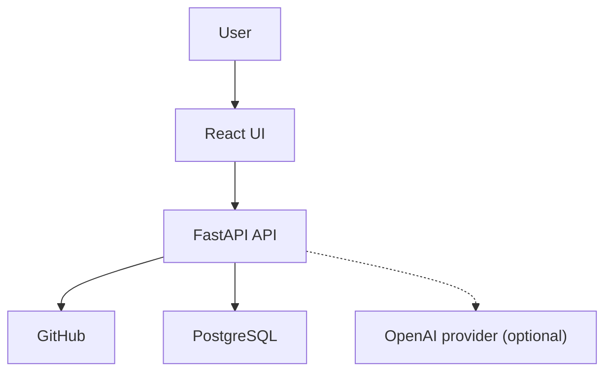
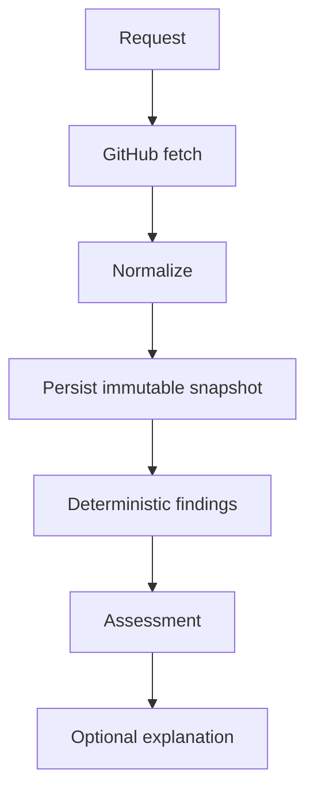
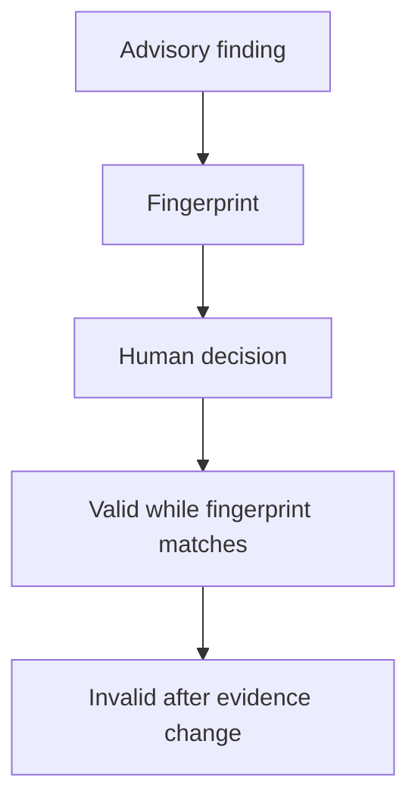

# Architecture

AI Release Intelligence is a modular monolith built around a fail-closed
release-readiness pipeline. One FastAPI service owns the use cases and keeps
its deterministic domain rules behind explicit application and adapter
boundaries. The React client, PostgreSQL database, GitHub API, and optional AI
provider remain outside that process boundary.

## System context

A release reviewer uses the React UI to request and inspect an analysis, follow
GitHub evidence, and record a governed decision for an advisory finding. The UI
uses the same-origin FastAPI API. The API reads authorized repository evidence
from GitHub, stores the resulting run in PostgreSQL, and may ask an OpenAI
provider to explain an already-persisted deterministic report.

The dashed edge is deliberately optional. Analysis, status calculation,
evidence, and human decisions do not depend on an AI response.

## Component boundaries

The modular-monolith boundary is the FastAPI deployable: use cases are modules
within one API service, not separately deployed microservices. The web and
database have separate runtime containers, while internal backend calls remain
ordinary typed Python calls.

| Boundary | Implemented responsibility |
| --- | --- |
| React web | Loads analysis runs, renders status and evidence, submits decisions, and requests optional explanations through the HTTP API. |
| FastAPI routes and schemas | Validate transport input, enforce session, CSRF, and repository-access checks, and translate safe application failures into HTTP responses. |
| Application services | Orchestrate release loading, deterministic assessment, persistence, human decisions, and explanation generation. |
| Deterministic domain | Applies policy to normalized scope, checks, blockers, operations, migrations, and back-merge evidence with fixed status precedence. It performs no HTTP, database, or AI calls. |
| Ports and adapters | Define the GitHub, policy, persistence, authentication, and AI contracts; concrete adapters implement GitHub REST/App access, PostgreSQL storage, and optional OpenAI access. |

This layout keeps provider and delivery concerns replaceable without splitting
the domain into distributed services. The main trade-off is shared deployment
and scaling for the backend modules; for the MVP, that is simpler than owning
cross-service consistency for one bounded analysis workflow.

## Analysis sequence

The evidence lineage is request, source collection, normalization, an immutable
snapshot boundary, deterministic findings, a status assessment, and only then
an optional explanation.

The diagram shows logical evidence lineage. In transaction timing, the current
implementation constructs a frozen snapshot in memory, evaluates it, and then
persists the snapshot, findings, evidence, and assessment atomically as one
completed run. The snapshot remains the sole source window for those findings;
the rules do not fetch GitHub data themselves.

Before normalization, the GitHub loader collects the bounded evidence window
twice and accepts it as complete only when both windows match. It sorts and
deduplicates issues, pull requests, issue-to-PR links, candidate checks, and
commit comparisons. Collection limits, inconsistent windows, partial
responses, and source errors become insufficiency evidence instead of a
best-effort positive result.

The assessor then evaluates every configured rule family and applies strict
precedence: `INSUFFICIENT_DATA`, `NOT_READY`, `NEEDS_DECISION`, then `READY`.
Missing or untrustworthy mandatory evidence therefore dominates all otherwise
positive findings.

## Evidence and persistence model

`ReleaseSnapshot` is the normalized source boundary. It records repository and
milestone identity, candidate ref and SHA, fetch timestamps, completeness,
source errors, issues and pull requests, their links, checks, and commit
comparisons. Each finding carries one or more `EvidenceRef` values with a source
type, source identity, direct URL, and fingerprint.

PostgreSQL stores a run with its policy version and source timestamp, the
snapshot as JSONB, and ordered findings plus evidence as relational rows. The
repository rejects snapshot replacement after persistence. This lets a reader
reconstruct which evidence and policy produced a verdict without consulting
mutable live GitHub state.

Creation uses one database transaction for the release identity, analysis run,
snapshot, findings, and evidence. Human decisions are later appended with a
same-snapshot reassessment, while the original snapshot remains unchanged. AI
explanation state is stored separately and cannot rewrite the run, findings,
evidence, or assessment.

## Human-decision lifecycle

Only an eligible failed advisory check can receive an `ACCEPTED_RISK` or
`RELEASE_BLOCKER` decision. Its fingerprint is a SHA-256 digest of the
repository, candidate SHA, check name, GitHub check-run ID, and conclusion.

The API accepts a decision only when the submitted run, finding, repository,
and fingerprint still identify the current decision-eligible finding. Inside a
locked database transaction, it reassesses the complete immutable snapshot,
appends the actor, reason, timestamp, decision kind, and supersession lineage,
and stores the resulting assessment.

A fresh analysis whose check evidence changes produces a different
fingerprint. The previous decision remains audit history, but it no longer
matches the evidence and cannot authorize the changed finding. A stale or
already-resolved run rejects a new decision rather than replaying only part of
the rule set.

## AI explanation boundary

The optional explanation runs after deterministic analysis and persistence. Its
input is an allowlisted projection of the stored report: bounded findings,
severities, required actions, and evidence identifiers. GitHub text is
normalized and treated as untrusted data; evidence URLs and fingerprints are
not sent to the provider.

The provider uses strict structured output and a total timeout. Application
validation requires exact finding and evidence references, preserves supplied
severity and required actions, and constructs the summary from deterministic
facts. The response schema has no field that can set readiness. Missing
configuration, refusal, malformed output, timeout, provider failure, or a
grounding mismatch returns an unavailable explanation while the deterministic
report remains intact.

## Deployment topology

The production Compose topology contains `postgres`, a one-shot `migrate`
container, `api`, and `web`. PostgreSQL must become healthy before migrations;
migrations must finish successfully before the API starts; and the API must be
healthy before the web service starts. The web container serves the React
bundle through unprivileged Nginx and proxies `/api/` to FastAPI.

Only the web service publishes a host port, bound to `127.0.0.1` by default.
PostgreSQL is attached only to the internal database network, the API bridges
the database and edge networks, and the web service is edge-only. Runtime
containers are read-only, use bounded temporary filesystems, and set
`no-new-privileges`. The optional OpenAI client is created inside the API only
when its key and token prices are configured; it is not a Compose service and
is absent from the deterministic test stack.

`compose.test.yaml` preserves the same service ordering and network separation,
but swaps live GitHub access for the deterministic fixture adapter and does not
configure an AI provider. That gives browser-level tests a repeatable release
window without production credentials.

## Failure behaviour

| Failure | Implemented outcome |
| --- | --- |
| Partial or stale mandatory GitHub data | The snapshot is incomplete or freshness adds insufficiency evidence. Fixed precedence forces `INSUFFICIENT_DATA`, so the run cannot produce `READY`. |
| GitHub rate limit | The loader preserves `github.rate_limited` and its reset time in snapshot source errors; analysis becomes `INSUFFICIENT_DATA` rather than reusing partial results. |
| Database write failure | The completed-run transaction is allowed to roll back, so no partial snapshot/finding set is committed. A separate failed-run audit is best-effort and cannot mask the original database error. |
| Invalid evidence URL | Repository-bound GitHub parsing rejects the evidence URL without dereferencing it. Rules surface an insufficiency code instead of accepting the locator. |
| AI failure | A malformed, refused, or timed-out AI response becomes `unavailable`; the previously persisted deterministic report, evidence, status, and human decisions remain intact. |

These behaviours make uncertainty visible. The system does not turn unavailable
data, stale governance, or optional-provider output into release authorization.

## Source map

| Concern | Primary implementation evidence |
| --- | --- |
| Runtime composition and dependency wiring | [FastAPI application](../../apps/api/src/release_intelligence/main.py) |
| React orchestration and API client | [React application](../../apps/web/src/app/App.tsx), [API client](../../apps/web/src/api/client.ts) |
| Analysis orchestration and GitHub normalization | [analysis service and loader](../../apps/api/src/release_intelligence/application/analyze_release.py) |
| Status precedence and freshness | [deterministic assessment](../../apps/api/src/release_intelligence/domain/assessment.py) |
| Deterministic rule families | [domain rules](../../apps/api/src/release_intelligence/domain/rules/) |
| GitHub access and rate-limit handling | [GitHub adapters](../../apps/api/src/release_intelligence/adapters/github/) |
| Atomic runs, immutable snapshots, and decision persistence | [PostgreSQL analysis repository](../../apps/api/src/release_intelligence/adapters/persistence/repositories.py), [persistence models](../../apps/api/src/release_intelligence/adapters/persistence/models.py) |
| Fingerprinted decisions | [decision application service](../../apps/api/src/release_intelligence/application/decisions.py), [check rules](../../apps/api/src/release_intelligence/domain/rules/checks.py) |
| AI grounding and safe failure | [explanation application service](../../apps/api/src/release_intelligence/application/explanations.py), [OpenAI adapter](../../apps/api/src/release_intelligence/adapters/ai/openai_provider.py) |
| Evidence URL validation | [GitHub evidence URL parser](../../apps/api/src/release_intelligence/security/urls.py) |
| Production and deterministic test topology | [production Compose](../../compose.yaml), [test Compose](../../compose.test.yaml), [Nginx proxy](../../apps/web/nginx.conf) |
| Automated architecture-level verification | [CI workflow](../../.github/workflows/ci.yml), [PostgreSQL workflow](../../.github/workflows/task-2-postgres.yml) |

Portfolio claims follow the [approved portfolio design](../superpowers/specs/2026-08-28-portfolio-package-design.md), with the current branch implementation and Compose files treated as the primary evidence.
