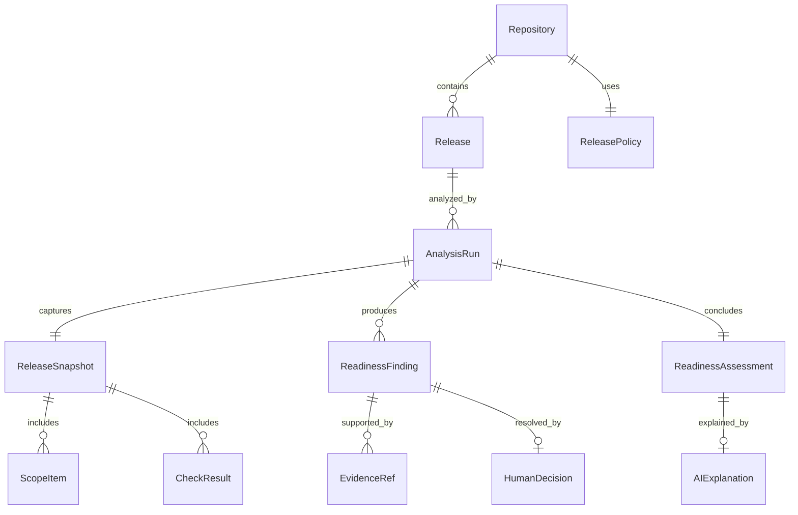
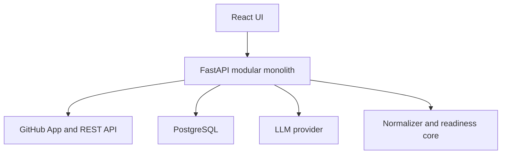

# AI Release Intelligence — Design Specification

**Date:** 2026-08-07

**Status:** Approved design; awaiting separate written-spec approval

**Product direction:** Release Readiness Gate

**Primary author and product owner:** Valeriy Malov

## 1. Executive summary

AI Release Intelligence is an evidence-backed Go/No-Go decision tool for Release Managers and Technical Project Managers in small GitHub-native product teams. It analyzes one GitHub Milestone and one release-candidate branch, applies deterministic readiness rules, requires explicit human decisions for ambiguous CI failures, and presents a minimal report with direct links to evidence.

The product does not use an LLM to decide whether a release is ready. The decision path is:

> GitHub data → normalized release snapshot → deterministic findings → human decisions → readiness status → optional AI explanation.

The primary outcome is to reduce an experienced manual release check from 30–60 minutes to a correct, evidence-backed decision in no more than five minutes, without missing critical blockers.

This project complements MoneyFlow rather than repeating it. MoneyFlow already demonstrates full-stack delivery, FastAPI, PostgreSQL, React/TypeScript, Docker, CI, testing, private production deployment, guarded AI fallback, and operational recovery. AI Release Intelligence must instead demonstrate release management, GitHub and CI/CD integration, evidence modeling, human-in-the-loop governance, AI grounding, security, and measurable evaluation.

## 2. Discovery summary

### Primary persona

Release Manager or Technical Project Manager in a small GitHub-native team with regular planned releases.

### Current workflow and pain

The experience-backed reference workflow is a weekly release assembled after code freeze. The Release Manager manually checks:

1. every release ticket that requires code has an attached PR;
2. required CI jobs pass and non-required failures are not release-critical;
3. changes merged into the previous release branch also have a PR merged to main;
4. DevOps actions before, during, and after release are documented;
5. migrations were successfully verified;
6. no unresolved critical blocker can prevent deployment or break critical functionality.

The largest time sinks are Issue–PR coverage and CI assessment. The current process takes 30–60 minutes per weekly Go/No-Go. Expert decisions about acceptable non-required CI failures are often recorded only in chat, so they are not durable evidence.

### JTBD

> When a release window approaches, I want to obtain a trustworthy status and prioritized list of required actions within minutes, so that I can make a Go/No-Go decision without manually checking GitHub objects and without missing a critical risk.

### Problem statement

- **Context:** a scheduled release is represented by a GitHub Milestone and a release-candidate branch.
- **Pain:** the Release Manager manually reconciles scope, PR, CI, operations, migrations, and blockers.
- **Existing workaround:** opening multiple GitHub pages and obtaining expert decisions in chat.
- **Why existing tools are insufficient:** GitHub exposes atomic data but does not synthesize a release-level, evidence-backed Go/No-Go decision with durable human waivers.
- **Desired outcome:** a correct report in no more than five minutes.
- **Why now:** release data is already machine-readable, while structured outputs make a bounded explanatory AI layer practical.
- **Product hypothesis:** deterministic evidence aggregation plus human decisions can reduce status-preparation time without delegating release authority to an LLM.

### Research landscape

- GitHub Milestones group Issues and PRs, Issue–PR relations are available as explicit links, and rulesets/checks expose CI state. GitHub does not provide the complete decision layer proposed here. Sources: [Milestones](https://docs.github.com/en/issues/using-labels-and-milestones-to-track-work/creating-and-editing-milestones-for-issues-and-pull-requests), [Issue–PR links](https://docs.github.com/en/issues/tracking-your-work-with-issues/using-issues/linking-a-pull-request-to-an-issue), [required checks](https://docs.github.com/en/repositories/configuring-branches-and-merges-in-your-repository/managing-rulesets/available-rules-for-rulesets).
- Harness focuses on deployment and post-deployment verification using metrics and logs. Source: [Harness Continuous Verification](https://developer.harness.io/docs/continuous-delivery/verify/verify-deployments-with-the-verify-step).
- Sleuth focuses on deployment tracking and delivery metrics. Source: [Sleuth deployment tracking](https://help.sleuth.io/sleuth-dora/modeling-your-deployments).
- Cortex evaluates ongoing service production readiness through scorecards, not a particular release milestone. Source: [Cortex Production Readiness](https://www.cortex.io/solutions/production-readiness).
- Faros, Jellyfish, and LinearB address broad engineering intelligence, delivery forecasting, and organizational metrics. Their breadth creates a niche for a smaller decision-focused tool.
- GitLab creates audit-ready evidence around a release, but within an integrated GitLab lifecycle. Source: [GitLab Releases](https://docs.gitlab.com/user/project/releases/).

### Validation status

No external interviews were conducted before design. The problem is grounded in the product owner's release-management experience but is not externally validated for GitHub-native teams. All adoption and willingness-to-pay assumptions remain unverified.

## 3. Product approaches considered

| Approach | Value | Complexity | Portfolio value | Toy-project risk | Part-time MVP estimate |
| --- | --- | ---: | ---: | ---: | ---: |
| Release Readiness Gate | Evidence-backed Go/No-Go for a milestone and candidate branch | Medium | Very high | Low | 4–6 weeks |
| Delivery Intelligence Platform | Metrics, bottlenecks, forecasting, and release risk | High | High | Medium | 8–12 weeks |
| AI Release Copilot | Chat, summaries, recommendations, and reports | Medium–high | Medium | High | 5–8 weeks |

The approved direction is **Release Readiness Gate**. It has the narrowest scope that directly addresses the measured workflow and gives AI a justified, non-authoritative role.

## 4. Product scope

### MVP capabilities

1. Connect one repository through a read-only GitHub App.
2. Select one GitHub Milestone as release scope.
3. Select one `release/YYYY-MM-DD` branch as the release candidate and CI target.
4. Configure the main branch, label mapping, check classification, required operations fields, and previous release branch.
5. Ingest Issues, PRs, links, commits, branches, checks, assignees, timestamps, labels, and milestone metadata.
6. Normalize source data into an immutable release snapshot.
7. Apply deterministic scope, CI, blocker, release-operations, migration, and back-merge rules.
8. Record `Accepted risk` or `Release blocker` decisions for advisory checks with actor, reason, time, and exact fingerprint.
9. Present `READY`, `NOT_READY`, `NEEDS_DECISION`, or `INSUFFICIENT_DATA` with prioritized actions and evidence.
10. Generate an optional grounded AI explanation.
11. Provide a synthetic demo repository, deterministic fixtures, automated benchmark, security tests, and portfolio documentation.

### Non-goals

- Jira, Bitbucket, Jenkins, GitLab, or other SCM/CI integrations;
- multi-repository releases;
- deployment orchestration, rollback, or post-deployment verification;
- delivery metrics and forecasting;
- AI chat;
- automatic acceptance of CI failures;
- scheduled analysis, webhooks, or notifications;
- enterprise RBAC, multi-tenancy, or billing.

## 5. UX and user flow

The UI is decision-first and intentionally avoids a metrics dashboard.

### First run

1. Install/connect the GitHub App.
2. Confirm detected repository settings and configure labels/check categories.
3. Select an open Milestone.
4. Select the release-candidate branch.
5. Run analysis.
6. Review the readiness report.

### Main report hierarchy

1. **Verdict:** status, analysis time, freshness, and refresh action.
2. **Attention required:** blockers, missing evidence, and unresolved decisions.
3. **Required actions:** action, owner, severity, and evidence link.
4. **Human decision queue:** advisory check, `Accepted risk`/`Release blocker`, mandatory reason, actor, and timestamp.
5. **Supporting details:** scope, PRs, checks, operations, migrations, and back-merge.

Supporting details use collapsible sections. There is no readiness score because it would imply false precision. A critical item is always one click from its GitHub evidence. AI text is visually separated from deterministic findings.

### Repeat flow

> Open release → refresh analysis → resolve new decisions → review blockers → Go/No-Go.

`READY` is impossible with stale or incomplete mandatory data. The default maximum report age at decision time is ten minutes; an older report requires refresh and displays `INSUFFICIENT_DATA` until a new run completes.

## 6. Domain model

### Source boundary

Raw GitHub payloads are processed inside the integration adapter and are not persisted in full. The system stores only fields required for normalization, auditability, and evidence. Full CI logs, repository source, and comments are not stored.

### Normalized facts

| Entity | Responsibility |
| --- | --- |
| `Repository` | Connected repository and default configuration |
| `ReleasePolicy` | Branches, label mapping, check classes, operations requirements, and rule-set version |
| `Release` | Selected GitHub Milestone |
| `AnalysisRun` | One analysis execution and its lifecycle |
| `ReleaseSnapshot` | Immutable normalized source state for a run |
| `ScopeItem` | Normalized Issue or PR in the milestone |
| `PullRequestLink` | Evidence-backed Issue–PR relation |
| `CheckResult` | Check category, status, conclusion, SHA, run ID, and URL |
| `OperationEvidence` | Structured release actions and migration evidence |
| `EvidenceRef` | Source type, GitHub ID, URL, timestamp, and fingerprint |

### Derived state

| Entity | Responsibility |
| --- | --- |
| `ReadinessFinding` | Result of one deterministic rule |
| `HumanDecision` | Accepted risk or blocker decision for an exact fingerprint |
| `ReadinessAssessment` | Final deterministic status and finding summary |
| `AIExplanation` | Optional structured narrative referencing existing findings/evidence |

A human decision is valid only while repository, candidate SHA, check identity, run ID, and conclusion match its fingerprint.

## 7. Architecture

The approved architecture is a modular monolith in one repository.

### Backend modules

- **GitHub Integration:** authentication, pagination, timeouts, rate-limit handling, and REST mapping.
- **Normalizer:** converts source data into an immutable snapshot.
- **Readiness Engine:** pure deterministic rules.
- **Decision Service:** records human decisions and recalculates assessment.
- **Explanation Service:** validates grounded AI output.
- **Benchmark Runner:** executes production rules and AI contracts against synthetic scenarios.
- **Persistence:** repositories for configuration, snapshots, findings, decisions, and audit metadata.

### Analysis flow

1. The UI requests analysis for a milestone and candidate branch.
2. The backend fetches and normalizes GitHub state.
3. The readiness engine persists findings and assessment.
4. The UI receives the deterministic report.
5. A separate request asks for AI explanation.
6. An LLM failure leaves the deterministic report intact.

Analysis is user-triggered. No scheduler, webhook, Redis, Celery, Kafka, vector database, Kubernetes, or microservices are included.

### GitHub App permissions

The app is read-only and restricted to selected repositories. Permissions are Metadata, Issues, Pull requests, Checks, Commit statuses, and Contents. Installation tokens are generated server-side and never exposed to the browser. GitHub recommends choosing the minimum permissions required; `Checks: read` is sufficient for reading check runs. Sources: [choosing permissions](https://docs.github.com/en/apps/creating-github-apps/registering-a-github-app/choosing-permissions-for-a-github-app), [Checks API](https://docs.github.com/en/rest/checks/runs).

### Deployment and observability

Docker Compose runs web, API, PostgreSQL, and a reverse proxy. Structured telemetry includes analysis duration/outcome, GitHub request count, rate-limit remainder, finding counts, LLM latency/tokens/cost, and fallback/validation failures.

## 8. AI boundary

The LLM receives validated findings, owners, approved evidence references, freshness, and limitations. It may summarize, group, explain impact, and order existing actions. It may not set readiness, change severity, accept a CI failure, create evidence, call tools, or write to GitHub.

### Contract

The provider interface accepts `ReadinessAssessmentInput` and returns `AIExplanation`. The first production adapter uses the OpenAI Responses API with a configurable model and `gpt-5.6` as the initial default. A deterministic fake is used in normal CI.

The response is constrained by a Pydantic-derived strict JSON Schema. Structured Outputs provide schema adherence, while application validation still checks semantic invariants. Source: [OpenAI Structured Outputs](https://developers.openai.com/api/docs/guides/structured-outputs).

Programmatic validation requires:

- every referenced finding and evidence ID exists in the allowlist;
- output severity matches the deterministic finding;
- every action references at least one finding;
- no new factual claim lacks a supplied reference;
- the full output passes schema validation.

Any structural or reference-integrity failure rejects the entire AI explanation. Reference allowlisting is necessary but cannot by itself prove that free-form prose is semantically supported; claim support is therefore measured separately in the benchmark and manually reviewed for portfolio results. Raw Issue/PR bodies and CI logs are excluded. Untrusted titles/names are length-limited and passed only as data. The model receives no tools or secrets.

One AI request is allowed per analysis run, with a 15-second timeout. The prompt contains all blockers and decision-required findings plus a bounded number of warnings. A timeout, refusal, malformed output, or business-invariant violation produces `AI explanation unavailable` without changing readiness.

## 9. Deterministic readiness algorithm

`ReleasePolicy` identifies main, candidate branch, labels, blocking/advisory/ignored checks, operations requirements, previous release branch/milestone, and rule-set version.

### Scope rules

For each Issue in the milestone:

- exactly one supported type label is required;
- `code-change` requires an explicit linked PR;
- the linked PR must also belong to the milestone;
- the PR must be merged into main;
- the merged change must be present in the candidate branch.

Any violation yields a blocking finding.

### CI rules

Checks are evaluated on the candidate branch HEAD.

| Condition | Result |
| --- | --- |
| Blocking check succeeds | Pass |
| Blocking check missing, pending, skipped, cancelled, or failed | `NOT_READY` |
| Advisory check failed or pending without a decision | `NEEDS_DECISION` |
| Advisory check with `Accepted risk` | Does not block `READY` |
| Advisory check with `Release blocker` | `NOT_READY` |
| New unknown check | `NEEDS_DECISION` until classified |
| Ignored check | No readiness effect |

### Blocker, operations, and migration rules

- An open current-milestone Issue labeled `release-blocker` yields `NOT_READY` and cannot be overridden in the app.
- A `release-ops` Issue requires an owner and non-placeholder `before`, `during`, and `after` sections.
- A `migration-required` Issue requires a link to a successful check/run in the connected repository. Unverifiable prose is not sufficient evidence.

### Back-merge rule

For PRs merged into the previous release branch, the engine resolves the linked Issue and requires a related PR merged into main. This mirrors the real process and remains valid when cherry-picking changes produces different commit hashes.

### Status precedence

1. `INSUFFICIENT_DATA` for incomplete, stale, or unavailable mandatory source data.
2. `NOT_READY` if any deterministic blocker or human-marked blocker exists.
3. `NEEDS_DECISION` if no blocker exists but a check requires classification/decision.
4. `READY` only when every applicable rule is satisfied.

All findings are preserved even when a higher-priority status is already known. The engine is pure: identical snapshot and policy produce identical findings and status.

## 10. Success metrics

### North Star

**Median time to a correct evidence-backed release decision.** The clock starts when the participant opens a prepared repository and ends when they identify the correct status, critical causes, and evidence.

The experience-based baseline is 30–60 minutes. The MVP target is no more than five minutes and at least a 70% reduction on the same scenarios.

### Acceptance thresholds

| Metric | Target |
| --- | ---: |
| Readiness agreement with ground truth | ≥95% |
| Recall of critical release blockers | 100% |
| Precision of detected risks | ≥95% |
| Evidence coverage for significant findings | 100% |
| Invalid evidence references | 0% |
| AI unsupported-claim rate | 0% |
| Schema-valid accepted AI outputs | 100% |
| Deterministic report during LLM outage | 100% |
| p95 deterministic analysis | ≤30 seconds |
| p95 AI explanation | ≤15 seconds |
| Cost per AI explanation | ≤$0.05 |
| Actions from installed App to first report | ≤6 |

Time savings cannot override correctness guardrails. Missing one critical blocker, evidence coverage below 100%, an unsupported AI claim, or `READY` on partial data makes the MVP unsuccessful.

Performance thresholds are measured against a documented benchmark profile of no more than 100 milestone items, 200 related PRs, and 100 candidate-SHA checks. p95 uses at least 30 runs. The 30-second deterministic target covers fixture-backed ingestion, normalization, persistence, and rules; live GitHub latency is reported separately rather than hidden in the benchmark.

## 11. Evaluation and testing strategy

Development follows Red → Green → Refactor.

### Unit and property-based tests

Unit tests cover normalization, classification, Issue–PR linkage, branch inclusion, check policy, decision invalidation, operations/migrations, back-merge, status precedence, evidence, AI input filtering, and output validation.

Property-based invariants include:

- adding a blocker cannot improve readiness;
- removing evidence cannot produce `READY`;
- partial input cannot produce `READY`;
- identical input and policy are deterministic;
- AI output cannot change assessment;
- decisions apply only to exact fingerprints.

### Integration, security, and E2E

- PostgreSQL integration tests cover migrations, constraints, immutable snapshots, audit decisions, concurrency, encryption boundaries, and rollback.
- GitHub and LLM use deterministic adapters and synthetic HTTP fixtures in normal CI.
- Security tests cover prompt injection, fake evidence, SSRF, stored XSS, malformed/oversized payloads, unauthorized repositories, expired tokens, and secret leakage.
- Playwright executes the vertical flow: connect fixture repo → choose release → analyze → inspect evidence → record decision → recalculate status.

### Benchmark dataset

At least 40 versioned synthetic scenarios include clean releases, missing PRs, candidate-branch omissions, failed/missing/pending checks, stale decisions, blockers, operations gaps, migration evidence, back-merge, compound risks, false-positive traps, malformed data, and prompt injection. Each scenario defines expected status, findings, severity, and evidence.

The deterministic benchmark runs in CI. A separate secret-protected `workflow_dispatch` runs the live provider benchmark before project releases. It is never executed on untrusted external PRs.

### Human-vs-tool experiment

At least six realistic scenarios use a crossover design: half are completed manually first and half with the tool first, then the order reverses. The report publishes timing, correctness, blockers found, sample size, and limitations. The initial 30–60 minute baseline is not presented as measured product impact.

### CI gates

1. Backend tests, Ruff, and mypy.
2. PostgreSQL tests and migrations.
3. Frontend tests, lint, typecheck, and build.
4. Playwright E2E.
5. Benchmark and security tests.
6. Docker Compose smoke test.
7. Secret and prohibited-artifact scan.

## 12. Error handling

| Failure | Required behavior |
| --- | --- |
| GitHub rate limit | Stop calls, preserve headers/reset time, return `INSUFFICIENT_DATA` |
| Partial GitHub response | Persist failed run metadata; never infer absence as success |
| Repository unavailable/unauthorized | Show actionable connection error; do not expose upstream details |
| Invalid/expired credentials | Re-authenticate; tokens never appear in errors |
| Candidate branch or milestone missing | Block analysis with configuration guidance |
| Check data missing/stale | `INSUFFICIENT_DATA` or deterministic blocker according to policy |
| Inconsistent GitHub state | Reject snapshot atomically and retry only through a new run |
| LLM timeout/refusal/malformed output | Keep deterministic report; show explanation unavailable |
| Database failure | Roll back run atomically; never show a partially persisted report |
| Evidence URL invalid | Reject evidence and finding output; never fetch arbitrary URL |

Retries are bounded and used only for transient upstream failures. A failed analysis run is auditable but is not reused as a current assessment.

## 13. Security design

### Authentication and authorization

- GitHub login establishes identity; sessions use `HttpOnly`, `Secure`, and `SameSite` cookies.
- OAuth callbacks use state validation; state-changing requests use CSRF protection.
- Every repository request verifies user, installation, and repository access on the backend.
- Human decisions store immutable actor ID and timestamp.

### Secrets and tokens

GitHub private key/client secret, user credentials, database credentials, and LLM key never appear in git, frontend, logs, or prompts. Installation tokens are short-lived and not persisted. Long-lived credentials are encrypted with a deployment secret separate from the database.

### Data minimization

The database excludes full CI logs, source code, comments, full raw payloads, and unnecessary profile fields. Repository disconnection deletes associated credentials and allows deletion of snapshots/decisions. Logs use an allowlist of safe structured fields.

### Threat controls

- Evidence URLs are constructed from trusted GitHub identifiers; the server does not fetch arbitrary user URLs.
- React output is escaped; raw HTML and unsafe Markdown are not rendered.
- LLM output is treated as untrusted text and validated data.
- Input sizes, pagination, request rates, and timeouts are bounded.
- Lockfiles, pinned CI actions, dependency scanning, and secret scanning protect the supply chain.
- Webhooks are absent from MVP. If introduced later, signature verification becomes mandatory.

Security deliverables are `docs/threat-model.md`, a permissions rationale, a secret-handling runbook, security tests, and a data-retention policy.

## 14. MVP versus post-MVP

### Required for the first portfolio release

- one read-only GitHub App connection and repository;
- Milestone scope and candidate branch;
- policy configuration;
- deterministic ingestion, normalization, and all approved readiness rules;
- human decision audit trail;
- decision-first report and evidence links;
- grounded AI explanation and deterministic fallback;
- demo repository/fixtures, 40+ scenario benchmark, CI, E2E, Docker smoke, and security tests;
- README, product case, architecture, threat model, runbook, screenshots, benchmark results, limitations, and key ADRs.

### Post-MVP

- multi-repository releases;
- Jira/Bitbucket/Jenkins/GitLab adapters;
- webhooks, scheduling, and status-change notifications;
- changes since the previous run;
- delivery metrics and forecasting;
- post-deployment verification and rollback;
- full CI-log analysis;
- chat interface;
- GitHub write-back through checks/comments;
- reusable organization policies, RBAC, multi-tenancy, and billing.

## 15. User-research plan retained for later validation

### Critical hypotheses

1. GitHub Milestone is an adequate source of release scope.
2. Issue–PR coverage and CI assessment are the dominant manual costs.
3. Teams will consistently classify Issues and checks through lightweight policy.
4. Durable waivers are more valuable than chat-only decisions.
5. A five-minute report materially improves the release workflow.
6. Single-repository releases represent a useful initial segment.
7. Release Managers trust deterministic evidence plus bounded AI explanation.

### Interview guide

1. Walk through the last Go/No-Go decision from start to finish.
2. Which systems and pages did you inspect, and in what order?
3. How was release scope defined and how often was it wrong or incomplete?
4. Which checks required manual reconciliation or follow-up?
5. How did you determine whether a failed CI job blocked the release?
6. Where were risk acceptances and release exceptions recorded?
7. Which missed condition has caused the most serious release problem?
8. How long does a normal and a problematic readiness review take?
9. Which evidence must be visible before you trust a `READY` status?
10. What would make you refuse to use an automated readiness report?
11. Where should the report appear in your workflow?
12. What data or permissions would you be unwilling to grant?

Future research should include three to five Release Managers, Technical PMs, Engineering Managers, or Tech Leads before making adoption or willingness-to-pay claims.

## 16. Explicit limitations and risks

- The product problem is experience-backed but not externally validated.
- Incorrect milestone membership or policy configuration can create an incomplete model.
- The system verifies the presence and machine-readable state of evidence, not the semantic correctness of every operational instruction.
- Human acceptance of a risk remains a human governance decision.
- A synthetic benchmark may overestimate performance on messy real repositories.
- One repository excludes common enterprise release structures.
- Reusing the MoneyFlow stack reduces delivery risk but does not itself add portfolio differentiation.

## 17. Design approval and next gate

Sections A–J were explicitly approved in conversation on 2026-08-07. This document must be reviewed and separately approved before `superpowers:writing-plans` is invoked. No application code, frontend/backend scaffolding, or implementation plan is authorized before that approval.
